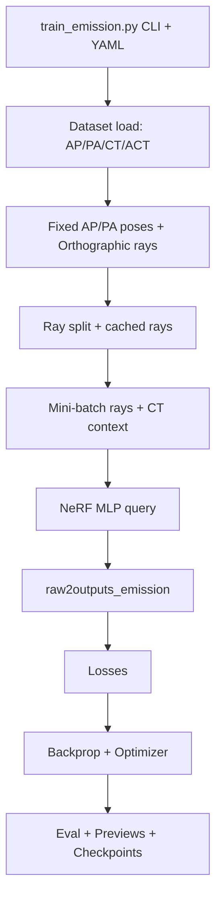

# pieNeRF Audit Overview (Code-Verified)

This document audits the current pipeline and critical claims against the codebase. Each block lists 3–8 statements with a status:
- [CONFIRMED] backed by code snippet (<=10 lines)
- [UNCLEAR] needs runtime verification; log/print guidance provided
- [WRONG] contradicts code


## Pipeline

### Block 0: Entry Points & Config-Merge
- [CONFIRMED] Training entry point is `train_emission.py` with `if __name__ == "__main__": train()`.
  - File: `pieNeRF/train_emission.py` (bottom)
  ```python
  if __name__ == "__main__":
      train()
  ```
- [CONFIRMED] Slurm wrapper launches `train_emission.py` with CLI flags.
  - File: `pieNeRF/run_train_emission.sh`
  ```bash
  srun python3 -u train_emission.py \
      --config configs/spect.yaml \
      --max-steps 2000 \
      --rays-per-step 16384 \
  ```
- [CONFIRMED] YAML is loaded and merged with CLI overrides; projections are assumed pre-normalized on disk.
  - File: `pieNeRF/train_emission.py` (train)
  ```python
  with open(args.config, "r") as f:
      config = yaml.safe_load(f)
  data_cfg = config.setdefault("data", {})
  ```
- [CONFIRMED] `get_data` and `build_models` are the entry points for dataset and model construction.
  - File: `pieNeRF/train_emission.py` (train)
  ```python
  dataset, hwfr, _ = get_data(config)
  config["data"]["hwfr"] = hwfr
  generator = build_models(config)
  ```

### Block 1: Data Pipeline (AP/PA/CT/ACT)
- [CONFIRMED] AP/PA are loaded from `.npy` as-is (no runtime normalization).
  - File: `pieNeRF/graf/datasets.py` (`_load_npy_image`)
  ```python
  arr = np.load(path).astype(np.float32)
  tensor = torch.from_numpy(arr).unsqueeze(0)
  ```
- [CONFIRMED] CT transpose order is applied as: `transpose(1,0,2)` (no scaling).
  - File: `pieNeRF/graf/datasets.py` (`_load_npy_ct`)
  ```python
  vol = np.load(path).astype(np.float32)
  vol = np.transpose(vol, (1, 0, 2))
  ```
- [CONFIRMED] ACT transpose order and scaling are applied as: `transpose(1,0,2)` then `*act_scale`.
  - File: `pieNeRF/graf/datasets.py` (`_load_npy_act`)
  ```python
  vol = np.load(path).astype(np.float32)
  vol = np.transpose(vol, (1, 0, 2))
  vol = vol * self.act_scale
  ```
- [CONFIRMED] `H,W` come from actual AP data, not from `data.imsize`.
  - File: `pieNeRF/graf/config.py` (`get_data`)
  ```python
  sample0 = dset[0]
  ap0 = sample0["ap"]
  _, H, W = ap0.shape
  dset.H = H
  dset.W = W
  ```

### Block 2: Geometry & Camera (AP/PA, Orthographic Rays)
- [CONFIRMED] Fixed AP/PA poses are defined at `+Z` and `-Z`; PA X-axis is flipped to correct mirroring.
  - File: `pieNeRF/graf/generator.py` (`set_fixed_ap_pa`)
  ```python
  loc_ap = np.array([0.0, 0.0, +float(radius)], dtype=np.float32)
  loc_pa = np.array([0.0, 0.0, -float(radius)], dtype=np.float32)
  self.pose_ap = _pose_from_loc(loc_ap, up=up)
  self.pose_pa = _pose_from_loc(loc_pa, up=up)
  self.pose_pa[:, 0] *= -1.0
  ```
- [CONFIRMED] Orthographic rays invert detector X axis (`grid_x = -grid_x`).
  - File: `pieNeRF/nerf/run_nerf_helpers_mod.py` (`get_rays_ortho`)
  ```python
  xs = torch.linspace(-0.5 * size_w, 0.5 * size_w, W, device=device, dtype=dtype)
  ys = torch.linspace(-0.5 * size_h, 0.5 * size_h, H, device=device, dtype=dtype)
  grid_y, grid_x = torch.meshgrid(ys, xs, indexing="ij")
  grid_x = -grid_x
  ```
- [CONFIRMED] Optional PA index flip during training uses `pa_xflip` to map indices.
  - File: `pieNeRF/train_emission.py` (`map_pa_indices_torch`)
  ```python
  y = idx // W
  x = idx % W
  return y * W + (W - 1 - x)
  ```
- [UNCLEAR] Global coordinate handedness is not explicitly documented; only `look_at` and axis flips exist.
  - Verify: log `pose_ap`, `pose_pa`, and a few `rays_d` vectors to ensure handedness and axis conventions.
  - Suggested log: in `pieNeRF/graf/generator.py` inside `set_fixed_ap_pa` add `print(self.pose_ap, self.pose_pa)`.

### Block 3: Ray Cache & Train/Test Split
- [CONFIRMED] Full AP/PA ray grids are precomputed once and cached.
  - File: `pieNeRF/train_emission.py` (`build_pose_rays` usage)
  ```python
  rays_cache = {
      "ap": build_pose_rays(generator, generator.pose_ap),
      "pa": build_pose_rays(generator, generator.pose_pa),
  }
  ```
- [CONFIRMED] Stratified tile-based split uses AP/PA targets and optional `pa_xflip`.
  - File: `pieNeRF/train_emission.py` + `pieNeRF/utils/ray_split.py`
  ```python
  pixel_split_np = make_pixel_split_from_ap_pa(
      ap_target_np, pa_target_np,
      train_frac=ray_split_ratio,
      tile=ray_split_tile,
      thr=ray_fg_thr_value,
      seed=ray_split_seed,
      pa_xflip=pa_xflip,
  )
  ```
- [CONFIRMED] When ray-split is disabled, a uniform random split is used.
  - File: `pieNeRF/train_emission.py` (`build_ray_split`)
  ```python
  split_uniform = build_ray_split(num_pixels, ray_split_ratio, device)
  ray_indices["pixel"]["train_idx_all"] = split_uniform["train"]
  ```

### Block 4: Mini-Batch Setup & Forward Inputs
- [CONFIRMED] AP/PA are flattened in raster order (`y*W+x`) without transpose.
  - File: `pieNeRF/train_emission.py`
  ```python
  ap_flat = ap.view(batch_size, -1)
  pa_flat = pa.view(batch_size, -1)
  ```
- [CONFIRMED] CT context is created per batch when CT exists.
  - File: `pieNeRF/train_emission.py`
  ```python
  ct_vol = batch.get("ct")
  ct_context = generator.build_ct_context(ct_vol) if ct_vol is not None else None
  ```
- [CONFIRMED] `render_minibatch` disables attenuation if CT context is missing.
  - File: `pieNeRF/train_emission.py` (`render_minibatch`)
  ```python
  if ct_context is not None:
      render_kwargs["ct_context"] = ct_context
  elif render_kwargs.get("use_attenuation"):
      render_kwargs["use_attenuation"] = False
  ```

### Block 5: NeRF Network & Conditioning
- [CONFIRMED] Emission mode uses a 1-channel output MLP.
  - File: `pieNeRF/nerf/run_nerf_mod.py` (`create_nerf`)
  ```python
  emission = getattr(args, "emission", False)
  output_ch = 1 if emission else 4
  model = NeRF(..., output_ch=output_ch, ...)
  ```
- [CONFIRMED] Latent code `z` is appended to positional encoding and expanded per sample.
  - File: `pieNeRF/nerf/run_nerf_mod.py` (`run_network`)
  ```python
  features = features.unsqueeze(1).expand(-1, inputs.shape[1], -1).flatten(0, 1)
  embedded = torch.cat([embedded, features_shape], -1)
  ```
- [CONFIRMED] Viewdirs are disabled by default in config (`use_viewdirs: False`).
  - File: `pieNeRF/configs/spect.yaml`
  ```yaml
  use_viewdirs: False
  ```
- [UNCLEAR] The exact split between shape and appearance features depends on `feat_dim_appearance`; verify actual dims at runtime.
  - Verify: print `features_shape.shape` and `features_appearance.shape` in `run_network`.

### Block 6: CT Context & μ Sampling
- [CONFIRMED] World coordinates are normalized by `radius`, clamped to [-1,1], and sampled with `grid_sample(align_corners=True)`.
  - File: `pieNeRF/nerf/run_nerf_mod.py` (`sample_ct_volume`)
  ```python
  coords = pts / radius
  coords = torch.clamp(coords, -1.0, 1.0)
  grid = coords.view(1, 1, N_rays, N_samples, 3)
  mu = F.grid_sample(volume, grid, mode="bilinear", padding_mode="border", align_corners=True)
  ```
- [CONFIRMED] CT context includes `value_range` for range warnings; no normalization is applied.
  - File: `pieNeRF/graf/generator.py` (`build_ct_context`)
  ```python
  vmin = float(vol.min().item())
  vmax = float(vol.max().item())
  return {"volume": vol, "grid_radius": radius, "value_range": (vmin, vmax)}
  ```

### Block 7: Emission Rendering
- [CONFIRMED] Emission uses `softplus(raw[...,0])` and integrates `sum(lambda_i * delta_s)`.
  - File: `pieNeRF/nerf/run_nerf_mod.py` (`raw2outputs_emission`)
  ```python
  lambda_vals = F.softplus(raw[..., 0])
  weights = lambda_vals * dists
  proj_map = torch.sum(weights, dim=-1)
  ```
- [CONFIRMED] Attenuation uses cumulative sum of `mu*delta_s`, scaled by `atten_scale`, and `exp(-attenuation)`.
  - File: `pieNeRF/nerf/run_nerf_mod.py` (`raw2outputs_emission`)
  ```python
  mu_dists = mu * dists
  attenuation = torch.cumsum(mu_dists, dim=-1) * float(atten_scale)
  attenuation = F.pad(attenuation[..., :-1], (1, 0), mode="constant", value=0.0)
  transmission = torch.exp(-attenuation)
  weights = lambda_vals * transmission * dists
  ```
- [WRONG] Hierarchical sampling is active when `N_importance>0`.
  - Reason: `render_rays` accepts `N_importance` but does not use it; no `sample_pdf` path exists.
  - File: `pieNeRF/nerf/run_nerf_mod.py` (`render_rays`)
  ```python
  def render_rays(..., N_importance=0, network_fine=None, ...):
      # N_importance is not used below
      pts = rays_o[..., None, :] + rays_d[..., None, :] * z_vals[..., :, None]
      raw = network_query_fn(pts, viewdirs, network_fn, features)
  ```

### Block 8: Losses & Regularization
- [CONFIRMED] Poisson NLL is the main projection loss with optional background down-weighting.
  - File: `pieNeRF/train_emission.py` (`poisson_nll`, `build_loss_weights`)
  ```python
  pred = pred.clamp_min(eps).clamp_max(clamp_max)
  nll = pred - target * torch.log(pred)
  if weight is not None:
      nll = nll * weight
  ```
- [CONFIRMED] ACT loss is L1 on sampled voxels; optional positive voxel weighting.
  - File: `pieNeRF/train_emission.py` (train loop)
  ```python
  pred_act = query_emission_at_points(generator, z_latent, coords)
  weights_act = torch.where(pos_flags, torch.full_like(pred_act, args.act_pos_weight), torch.ones_like(pred_act))
  loss_act = torch.mean(weights_act * torch.abs(pred_act - act_samples))
  ```
- [CONFIRMED] CT loss enforces smoothness along z-adjacent CT pairs.
  - File: `pieNeRF/train_emission.py`
  ```python
  pred1 = query_emission_at_points(generator, z_latent, coords1)
  pred2 = query_emission_at_points(generator, z_latent, coords2)
  loss_ct = torch.mean(torch.abs(pred1 - pred2) * weights)
  ```
- [CONFIRMED] TV losses used: base TV from render extras, and optional ray-TV from raw outputs.
  - File: `pieNeRF/train_emission.py`
  ```python
  tv_base_loss = torch.stack(tv_base_terms).mean()
  loss_tv = tv_weight * tv_base_loss
  loss_ray_tv = torch.stack(ray_tv_terms).mean()
  ```
- [WRONG] `tv_weight_mu`, `mu_gate_*`, `tv3d_*`, `mask-loss` are active losses.
  - Reason: these config values exist in YAML but are never referenced in `train_emission.py`.
  - Verify by search: no references in training loop.

### Block 9: Backprop & Optimizer
- [CONFIRMED] Optimizer is Adam over generator params (plus hybrid modules when enabled) with gradient clipping.
  - File: `pieNeRF/train_emission.py`
  ```python
  opt_params = list(generator.parameters())
  if hybrid_enabled and encoder is not None:
      opt_params += list(encoder.parameters())
  if hybrid_enabled and z_fuser is not None:
      opt_params += list(z_fuser.parameters())
  if hybrid_enabled and gain_head is not None:
      opt_params += list(gain_head.parameters())
  if hybrid_enabled and gain_param is not None:
      opt_params += [gain_param]
  optimizer = torch.optim.Adam(opt_params, lr=config["training"]["lr_g"])
  torch.nn.utils.clip_grad_norm_(generator.parameters(), max_norm=1.0)
  ```
- [CONFIRMED] AMP is optional and controlled by `training.use_amp`.
  - File: `pieNeRF/train_emission.py`
  ```python
  amp_enabled = bool(config["training"].get("use_amp", False))
  scaler = torch.cuda.amp.GradScaler(enabled=amp_enabled)
  ```

### Block 10: Eval/Logging/Artifacts
- [CONFIRMED] Evaluation uses shared index subsets and renders AP/PA in eval mode.
  - File: `pieNeRF/train_emission.py` (`evaluate_pixel_subsets`)
  ```python
  pred_ap, _ = render_minibatch(generator, z_latent, ray_batch_ap, ct_context=ct_context)
  pred_pa, _ = render_minibatch(generator, z_latent, ray_batch_pa, ct_context=ct_context)
  ```
- [CONFIRMED] Previews are rendered periodically and saved as PNGs (AP/PA).
  - File: `pieNeRF/train_emission.py` (`maybe_render_preview`)
  ```python
  proj_ap, _, _, _ = generator.render_from_pose(z_eval, generator.pose_ap, ct_context=ctx)
  proj_pa, _, _, _ = generator.render_from_pose(z_eval, generator.pose_pa, ct_context=ctx)
  save_img(ap_np, out_dir / f"step_{step:05d}_AP.png", title=f"AP @ step {step}")
  ```
- [CONFIRMED] Checkpoints contain generator weights, optimizer, scaler, and optional hybrid modules; `z_train` is no longer stored.
  - File: `pieNeRF/train_emission.py` (`save_checkpoint`)
  ```python
  state = {
      "step": step,
      "optimizer": optimizer.state_dict(),
      "scaler": scaler.state_dict(),
      "generator_coarse": generator.render_kwargs_train["network_fn"].state_dict(),
  }
  if generator.render_kwargs_train["network_fine"] is not None:
      state["generator_fine"] = generator.render_kwargs_train["network_fine"].state_dict()
  if encoder is not None:
      state["encoder"] = encoder.state_dict()
  if z_fuser is not None:
      state["z_fuser"] = z_fuser.state_dict()
  if gain_head is not None:
      state["gain_head"] = gain_head.state_dict()
  if gain_param is not None:
      state["gain_param"] = gain_param.detach().cpu()
  ```


## Coordinate Contract

- World coordinates are assumed in a cube `[-radius, radius]^3` and are normalized by `radius` before CT sampling.
  - File: `pieNeRF/nerf/run_nerf_mod.py` (`sample_ct_volume`)
  ```python
  coords = pts / radius
  coords = torch.clamp(coords, -1.0, 1.0)
  ```
- Orthographic ray origins cover a plane of size `(size_w, size_h)` centered on origin; directions are `-c2w[:,2]`.
  - File: `pieNeRF/nerf/run_nerf_helpers_mod.py` (`get_rays_ortho`)
  ```python
  rays_d = -c2w[:3, 2].view(1, 1, 3).expand(H, W, -1)
  rays_o = rays_o + c2w[:3, -1].view(1, 1, 3)
  ```
- PA mirroring fix is applied in pose creation (`pose_pa[:,0]*=-1.0`) and optional index flip (`pa_xflip`).
  - Files: `pieNeRF/graf/generator.py`, `pieNeRF/train_emission.py`


## Forward Model (Formeln)

- Emission-only integral:
  - `lambda_i = softplus(raw[...,0])`
  - `dists_i = (z_{i+1}-z_i) * ||ray_d||`
  - `I = sum_i lambda_i * dists_i`
  - File: `pieNeRF/nerf/run_nerf_mod.py` (`raw2outputs_emission`)

- With attenuation:
  - `mu_dists = mu * dists`
  - `A_i = cumsum(mu_dists) * atten_scale`, shifted left by one sample
  - `T_i = exp(-A_i)`
  - `I = sum_i lambda_i * T_i * dists_i`
  - File: `pieNeRF/nerf/run_nerf_mod.py` (`raw2outputs_emission`)

- No PSF/collimator/scatter terms are present in the render path:
  - Evidence: `raw2outputs_emission` only computes per-ray sums and exponentials; no convolution or kernel usage.
  - File: `pieNeRF/nerf/run_nerf_mod.py` (`raw2outputs_emission`)
  ```python
  transmission = torch.exp(-attenuation)
  weights = lambda_vals * transmission * dists
  proj_map = torch.sum(weights, dim=-1)
  ```


## Losses

Active in training loop:
- Poisson NLL (`poisson_nll`) + optional background weights (`build_loss_weights`)
- ACT L1 loss with optional positive voxel weighting
- CT smoothness loss on adjacent z samples
- z-regularization (L2)
- TV loss from `raw2outputs_emission` extras (`tv_loss`)
- Ray-TV loss from raw outputs

Not active despite config presence:
- `tv_weight_mu`, `mu_gate_*`, `tv3d_*`, `mask-loss` are not referenced in `train_emission.py`.


## Config Map

Key config parameters and where they are used:
- `data.manifest` -> `SpectDataset` in `pieNeRF/graf/datasets.py`
- `data.radius`, `data.fov` -> `get_data` in `pieNeRF/graf/config.py`
- `data.orthographic` -> `Generator` and ray sampler selection in `pieNeRF/graf/generator.py`
- `data.near/far` -> `render_kwargs_*` in `pieNeRF/graf/config.py`
- `nerf.N_samples`, `nerf.N_importance`, `nerf.perturb` -> `create_nerf` in `pieNeRF/nerf/run_nerf_mod.py`
- `nerf.use_attenuation`, `nerf.atten_scale` -> `build_models` and `raw2outputs_emission`
- `training.chunk`, `training.netchunk` -> `build_models` in `pieNeRF/graf/config.py`
- `training.lr_g` -> Adam in `pieNeRF/train_emission.py`

Special checks:
- A) Projections are assumed normalized on disk (no runtime normalization) (see Block 0/1).
- B) CT/ACT transpose + scaling are in `pieNeRF/graf/datasets.py` (see Block 1).
- C) world->grid_sample: normalization + clamp + `align_corners=True` in `pieNeRF/nerf/run_nerf_mod.py` (see Block 6).
- D) PA xflip & grid_x inversion both exist (see Block 2).
- E) Hierarchical sampling: `N_importance` is not used; no `sample_pdf` path (see Block 7).
- F) Active losses only: Poisson, ACT, CT, TV, ray-TV, z-reg (see Block 8).
- G) Forward operator has only line integral + attenuation (see Forward Model section).


## Known Limitations

- No hierarchical sampling even if `N_importance>0` (unused in `render_rays`).
- Config-only loss terms (`tv_weight_mu`, `mu_gate_*`, `tv3d_*`, `mask-loss`) are not implemented in training code.
- Coordinate handedness is implicit; relies on `look_at` + axis flips and should be validated with runtime prints.


## Mermaid Flowchart (Optional)


